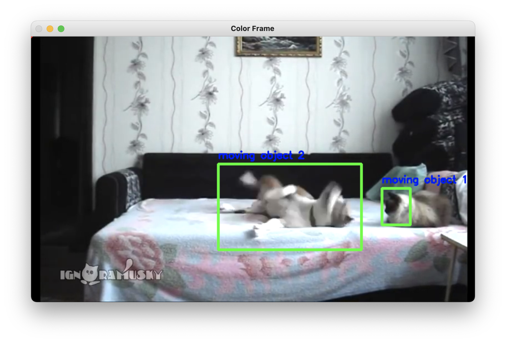
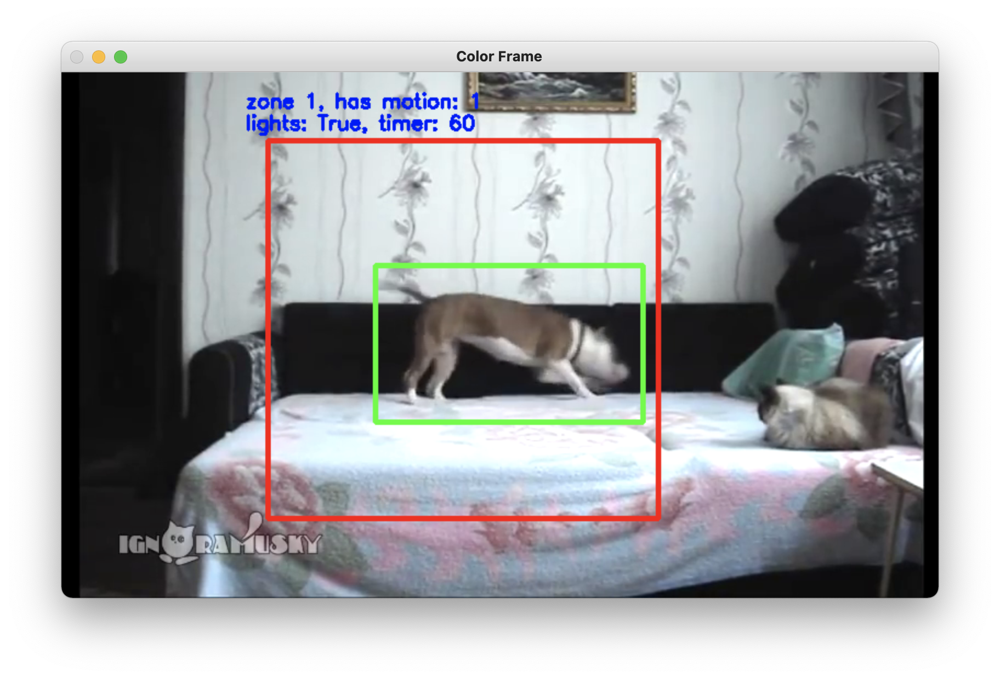
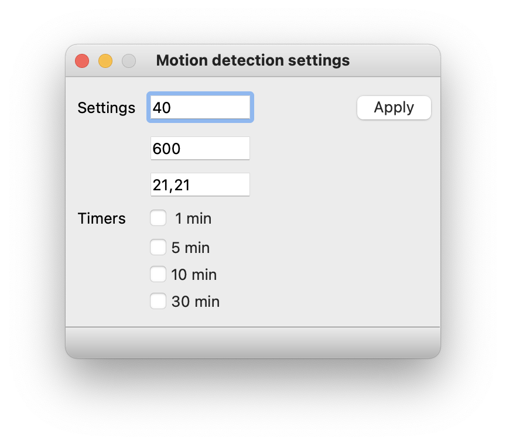

# auto-lights-control

## This is an automatic lights switching system based on image recognition and motion detection
This application was built as a pet-project by me as an ***openCV*** and ***PyQT*** practice.

### App's flow

Application has ***2 modes of motion capture***

1. General motion recognition (uses whole frame to detect motion):

2. Motion recognition with zone selection (uses zone area to detect motion):

### App's settings

You can change motion detection sensitivity (threshold, area and kernel size) and choose timer that will be decreased if zone has no motion and updated if zone has motion.

If timer expires, the light in the specific zone will be switched off.

If the light is off and zone receives motion, it will be then switched on again.

### Controls

1. Use ***mouse drag*** to select zone.
2. Use ***e*** to activate zone based motion detection
3. Use ***c*** to clear zones and return back to a general motion detection mode
